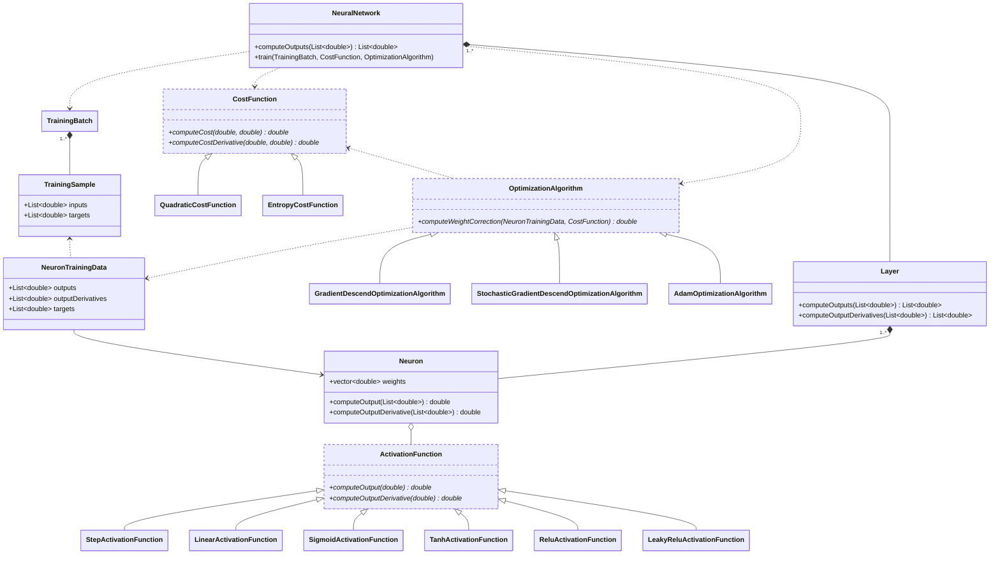
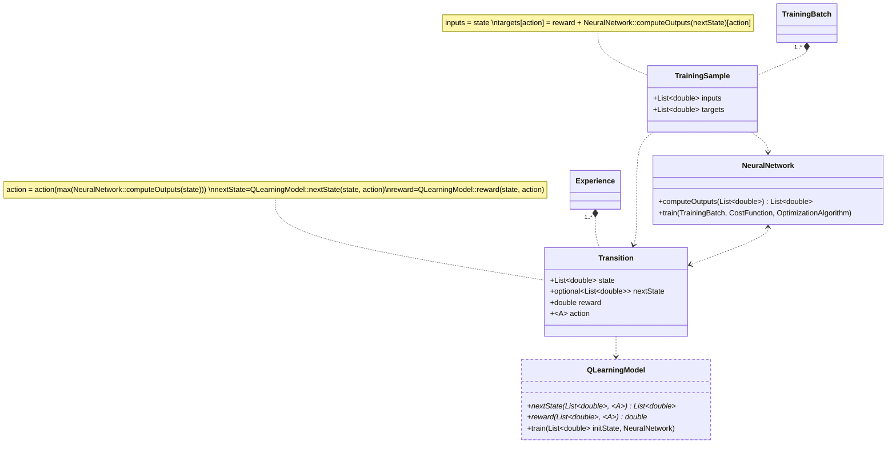

# Neural Networks Notes

## Contents
- [List of Symbols](https://github.com/alejandrofsevilla/neural_networks_cheat_sheet?tab=readme-ov-file#list-of-symbols)
- [Neuron Equations](https://github.com/alejandrofsevilla/neural_networks_cheat_sheet?tab=readme-ov-file#neuron-equations)
  - [Neuron Intermediate Quantity](https://github.com/alejandrofsevilla/neural_networks_cheat_sheet?tab=readme-ov-file#neuron-intermediate-quantity)
  - [Neuron Output](https://github.com/alejandrofsevilla/neural_networks_cheat_sheet?tab=readme-ov-file#neuron-output)
- [Training Algorithm](https://github.com/alejandrofsevilla/neural_networks_cheat_sheet?tab=readme-ov-file#training-algorithm)
  - [Chain Rule](https://github.com/alejandrofsevilla/neural_networks_cheat_sheet?tab=readme-ov-file#chain-rule)
  - [Backpropagation](https://github.com/alejandrofsevilla/neural_networks_cheat_sheet?tab=readme-ov-file#backpropagation)
- [Activation Functions](https://github.com/alejandrofsevilla/neural_networks_cheat_sheet?tab=readme-ov-file#activation-functions)
  - [Binary Step](https://github.com/alejandrofsevilla/neural_networks_cheat_sheet?tab=readme-ov-file#binary-step)
  - [Linear](https://github.com/alejandrofsevilla/neural_networks_cheat_sheet?tab=readme-ov-file#linear)
  - [ReLU](https://github.com/alejandrofsevilla/neural_networks_cheat_sheet?tab=readme-ov-file#relu)
  - [Leaky ReLU](https://github.com/alejandrofsevilla/neural_networks_cheat_sheet?tab=readme-ov-file#leaky-relu)
  - [Sigmoid](https://github.com/alejandrofsevilla/neural_networks_cheat_sheet?tab=readme-ov-file#sigmoid)
  - [Tanh](https://github.com/alejandrofsevilla/neural_networks_cheat_sheet?tab=readme-ov-file#tanh)
- [Cost Functions](https://github.com/alejandrofsevilla/neural_networks_cheat_sheet?tab=readme-ov-file#cost-functions)
  - [Quadratic Cost](https://github.com/alejandrofsevilla/neural_networks_cheat_sheet?tab=readme-ov-file#quadratic-cost)
  - [Cross Entropy Cost](https://github.com/alejandrofsevilla/neural_networks_cheat_sheet?tab=readme-ov-file#cross-entropy-cost)
- [Normalization](https://github.com/alejandrofsevilla/neural_networks_cheat_sheet?tab=readme-ov-file#normalization)
- [Regularization](https://github.com/alejandrofsevilla/neural_networks_cheat_sheet?tab=readme-ov-file#regularization)
  - [L1](https://github.com/alejandrofsevilla/neural_networks_cheat_sheet?tab=readme-ov-file#l1)
  - [L2](https://github.com/alejandrofsevilla/neural_networks_cheat_sheet?tab=readme-ov-file#l2)
- [Optimization Algorithms](https://github.com/alejandrofsevilla/neural_networks_cheat_sheet?tab=readme-ov-file#optimization-algorithms)
  - [Gradient Descend](https://github.com/alejandrofsevilla/neural_networks_cheat_sheet?tab=readme-ov-file#gradient-descend)
  - [Stochastic Gradient Descend](https://github.com/alejandrofsevilla/neural_networks_cheat_sheet?tab=readme-ov-file#stochastic-gradient-descend)
  - [Adaptive Moment Estimation](https://github.com/alejandrofsevilla/neural_networks_cheat_sheet?tab=readme-ov-file#adaptive-moment-estimation)
- [Neural Network Implementation](https://github.com/alejandrofsevilla/neural_networks_cheat_sheet?tab=readme-ov-file#neural-network-implementation)
- [Q-Learning](https://github.com/alejandrofsevilla/neural_networks_cheat_sheet?tab=readme-ov-file#q-learning)
  - [Q-Learning Algorithm Implementation](https://github.com/alejandrofsevilla/neural_networks_cheat_sheet?tab=readme-ov-file#q-learning-algorithm-implementation)
- [References](https://github.com/alejandrofsevilla/neural_networks_cheat_sheet?tab=readme-ov-file#references)

## List of Symbols

$\large s$ *= sample*\
$\large S$ *= number of samples in training batch*\
$\large l$ *= layer*\
$\large L$ *= number of layers*\
$\large n_l$ *= neuron at layer l*\
$\large N_l$ *= number of neurons in layer l*\
$\large w_{n_{l-1}n_l}$ *= weight between neurons* $n_{l-1}$ *and* $n_l$\
$\large b_{n_l}$ *= bias of neuron* $n_l$\
$\large z_{n_l}$ *= intermediate quantity of neuron* $n_l$\
$\large y_{n_l}$ *= output of neuron* $n_l$\
$\large \hat y_{n_l}$ = *target output of neuron* $n_l$\
$\large A_{n_l}$ *= activation function at neuron* $n_l$ *{Binary Step, Linear, ReLU, Sigmoid, Tanh...}*\
$\large C$ *= cost function {MSE, SSE, WSE, NSE...}*\
$\large O$ *= optimization Algorithm {Gradient Descend, ADAM, Quasi Newton Method...}*\
$\large α$ *= learning rate*

## Neuron Equations

  

### Neuron Intermediate Quantity
$$ \large 
z_{n_l} = \sum_{n_{l-1}}^{N_{l-1}}(w_{n_{l-1}n_l} \cdot y_{n_{l-1}} + b_{n_l}) 
$$
### Neuron Output
$$ \large
y_{n_l} = A_{n_l}\big(z_{n_l}\big)
$$

## Training Algorithm

In order to reduce the errors of the network, weights and biases are adjusted to minimize a given cost function $C$. This is done by an optimization algorithm $O$, that modifies the network parameters periodically after running a certain number of training samples.
Weights and biases are modified depending on their influence in the cost function, measured by the derivatives ${\partial C}/{\partial {w_{n_{l-1}n_l}}}$ and ${\partial C}/{\partial {b_{n_l}}}$.

$$ \large
\Delta w_{n_{l-1}n_l} = - α \cdot O\big(\frac {\partial C}{\partial {w_{n_{l-1}n_l}}}\big)
$$

$$ \large
\Delta b_{n_l} = - α \cdot O\big(\frac {\partial C}{\partial {b_{n_l}}}\big)
$$

### Chain Rule
The chain rule allows to separate the derivatives of the cost function into components:

$$ \large
\frac {\partial C}{\partial {w_{n_{l-1}n_l}}} 
= \frac{\partial C}{\partial z_{n_l}} \cdot \frac{\partial z_{n_l}}{\partial {w_{n_{l-1}n_l}}}
= \frac{\partial C}{\partial z_{n_l}} \cdot y_{n_{l-1}}
= \frac{\partial C}{\partial y_{n_l}} \cdot \frac{\partial y_{n_l}}{\partial z_{n_l}} \cdot y_{n_{l-1}}
= \dot C\big(y_{n_l}, \hat y_{n_l}\big) \cdot \dot A_{n_l}\big(z_{n_l}\big) \cdot y_{n_{l-1}}
$$

$$ \large
\frac {\partial C}{\partial {b_{n_l}}} 
= \frac{\partial C}{\partial z_{n_l}}
= \frac{\partial C}{\partial y_{n_l}} \cdot \frac{\partial y_{n_l}}{\partial z_{n_l}}
= \dot C\big(y_{n_l}, \hat y_{n_l}\big) \cdot \dot A_{n_l}\big(z_{n_l}\big)
$$

### Backpropagation

The terms $\dot C (y_{n_l} \hat y_{n_l})$ depend on the output target value for each neuron $\hat y_{n_l}$. However, a training data set only counts on the value of $\hat y_{n_l}$ for the last layer $l = L$. Instead, for all previous layers $l < L$, components $\dot C ( y_{n_l}, \hat y_{n_l})$ are computed as a weighted sum of the components previously calculated for the next layer $\dot C (y_{n_{l+1}}, \hat y_{n_{l+1}})$ :

$$ \large
\dot C \big( y_{n_l}, \hat y_{n_l} \big) = \sum_{n_{l+1}}^{N_{l+1}} w_{n_{l}n_{l+1}} \cdot \dot C \big( y_{n_{l+1}}, \hat y_{n_{l+1}} \big) 
$$

## Activation Functions
### Binary Step

  

$$ \large
\begin{split}A \big(z\big) = \begin{Bmatrix} 1 & z ≥ 0 \\
 0 & z < 0 \end{Bmatrix}\end{split}
$$

$$ \large 
\dot A \big(z\big) = 0
$$

### Linear

  

$$ \large
A \big(z\big) = z
$$

$$ \large
\dot A \big(z\big) = 1
$$

### ReLU (Rectified Linear Unit)

  

$$ \large
\begin{split}A \big(z\big) = \begin{Bmatrix} z & z > 0 \\
 0 & z ≤ 0 \end{Bmatrix}\end{split}
$$

$$ \large
\begin{split}\dot A \big(z\big) = \begin{Bmatrix} 1 & z > 0 \\
 0 & z ≤ 0 \end{Bmatrix}\end{split}
$$

### Leaky ReLU

  

$$ \large
\begin{split}A \big(z, \tau \big) = \begin{Bmatrix} z & z > 0 \\
\tau \cdot z & z ≤ 0 \end{Bmatrix}\end{split}
$$

$$ \large
\begin{split}\dot A \big(z, \tau \big) = \begin{Bmatrix} 1 & z > 0 \\
\tau & z ≤ 0 \end{Bmatrix}\end{split}
$$

where typically:

$$ \large \tau=0.01 $$

### Sigmoid

  

$$ \large
A \big(z\big) = \frac{1} {1 + e^{-z}}
$$

$$ \large
\dot A \big(z\big) = A(z) \cdot (1-A(z))
$$

### Tanh

  

$$ \large
A \big(z\big) = \frac{e^{z} - e^{-z}}{e^{z} + e^{-z}}
$$

$$ \large
\dot A \big(z\big) = 1 - {A(z)}^2 
$$

## Cost Functions

### Quadratic Cost
$$\large C\big(y, \hat y\big) = 1/2 \cdot {\big(y - \hat y\big)^{\small 2}}$$

$$\large\dot C\big(y, \hat y\big) = \big(y - \hat y\big)$$

### Cross Entropy Cost
$$ \large
C\big(y, \hat y\big) = -\big({\hat y} \text{ ln } y + (1 - {\hat y}) \cdot \text{ ln }(1-y)\big)
$$

$$ \large
\dot C\big(y, \hat y\big) = \frac{y - \hat y}{(1-y) \cdot y}
$$

## Normalization
Normalization is the process of adimensionalizing the input layer, bringing all parameters to the same scale. Normalization addresses a problem known as Internal Covariate Shift and helps training to converge more quicly.

$$ \large
 \bar {x} = \frac{x-\mu}{\sqrt{{\sigma}^2+\epsilon}}
$$

With:

$$ \large \mu = \frac {1}{S} \cdot \sum^{S} x_s $$ 

$$ \large {σ}^2 = \frac {1}{S} \cdot \sum^{S} (x_s - \mu)^2 $$ 

Where $\mu_{\beta}$ and $\sigma_{\beta}$ are the mean and standard deviation respectively, for that mini batch, and $\epsilon$ is small positive value such us $10^{-7}$ to avoid zero division.

## Regularization
Extra terms are added to the cost function in order to address overfitting.

### L2

$$ \large
C_{n_l} \big(y, \hat y\big) = C \big(y, \hat y\big) + \frac{\lambda}{2 \cdot N_{l-1}} \cdot \sum_{n_{l-1}}^{N_{l-1}} w_{n_{l-1}n_l}^2
$$

$$ \large
\dot C_{n_l} \big(y, \hat y\big) = \dot C \big(y, \hat y\big) + \lambda \cdot \sum_{n_{l-1}}^{N_{l-1}} w_{n_{l-1}n_l}
$$

### L1

$$ \large
C_{n_l} \big(y, \hat y\big) = C \big(y, \hat y\big) + \lambda \cdot \sum_{n_{l-1}}^{N_{l-1}} |w_{n_{l-1}n_l}|
$$

$$ \large
\dot C_{n_l} \big(y, \hat y\big) = \dot C \big(y, \hat y\big) ± \lambda 
$$

## Optimization Algorithms
### Gradient Descend
Network parameters are updated after every training batch $S$, averaging across all training samples.

$$ \large
O \big( \frac{\partial C}{\partial {w_{n_{l-1}n_l}}} \big) = \frac{1}{S} \cdot \sum_{s}^S{\frac{\partial C}{\partial {w_{n_{l-1}n_l}}}}
$$

### Stochastic Gradient Descend
It is a gradient descend performed after every training sample $s$.

$$ \large
O \big( \frac{\partial C}{\partial {w_{n_{l-1}n_l}}} \big) = \frac{\partial C}{\partial {w_{n_{l-1}n_l}}}
$$

### Adaptive Moment Estimation
Network parameters are updated after every training batch $S$, with an adapted value of the cost function derivatives.

$$ \large
O \big( \frac{\partial C}{\partial {w_{n_{l-1}n_l}}} \big) = \frac{m_t}{\sqrt{v_t}+\epsilon}
$$

where:

$$ \large
m_t = \beta_1 \cdot m_{t-1} + (1+\beta_1) \cdot \big( \frac{1}{S} \cdot \sum_{s}^S{\frac{\partial C}{\partial {w_{n_{l-1}n_l}}}} \big)
$$

$$ \large
v_t = \beta_2 \cdot v_{t-1} + (1+\beta_2) \cdot \big( \frac{1}{S} \cdot \sum_{s}^S{\frac{\partial C}{\partial {w_{n_{l-1}n_l}}}} \big)
$$

where typically:

$$ \large m_0 = 0 $$

$$ \large v_0 = 0 $$

$$ \large \epsilon = 1/10^{\small 8} $$

$$ \large \beta_1 = 0.9 $$

$$ \large \beta_2 = 0.999 $$

## Neural Network Implementation

## Q-Learning

Given a model state $s$ and a set of possible actions at that state { $a_1$, $a_2$, ..., $a_n$ }, a neural network computes the quality values $Q_a$ for each action so that the best possible action will be given by the highest $Q_a$. The problem consists in finding how to train such neural network as the target $\hat {Q}_a(s)$ values to train the network against, are in principle unknown. An iterative process is followed in which a prediction of $\hat {Q}_a(s)$ is periodically updated through experience. 

Starting from the Bellman equation:

$$ \large
Q(s,a)=R(s,a)+ \gamma \cdot {Q(s', a)_{max}}
$$

Which states that the total $Q$ value of taking an action $a$ at state $s$, is equal to the immediate reward of taking the action, $R(s,a)$, plus the total reward obtained by taking the best possible action thereafter until termination, ${Q(s', a)_{max}}$. A discount factor $\gamma$ is added to the equation to control the priority between inmediate or later rewards. 

The adition from Machine Learning is that a neural network $N$ is used to make a prediction of the second term of the equation. At the begining of an epoch, the model starts at the initial state and takes one transition at a time. An exploration factor $\epsilon$ is used to control the proportion of transitions in which the model will use the trained network (explotation) to select an action, $a = a(N, s)$, and transitions in which the action will be randomly selected (exploration). Each transition is stored as part of the experience, typically in a circular buffer. After a transition, the same neural network (DQN) or a second neural network (DDQN) - updated only every few iterations - is used to update the network targets for that state and action:

$$ \large
\hat {Q}(s,a) = R(s,a)+ \gamma \cdot Q(N, s')_{max}
$$

The network is retrained, and the process is then repeated until termination before starting the next epoch.

### Q-Learning Algorithm Implementation

## References
- http://neuralnetworksanddeeplearning.com/
- https://www.analyticsvidhya.com/blog/2020/04/feature-scaling-machine-learning-normalization-standardization/
- https://comsm0045-applied-deep-learning.github.io/Slides/COMSM0045_05.pdf
- https://towardsdatascience.com/optimizers-for-training-neural-network-59450d71caf6
- https://stats.stackexchange.com/questions/154879/a-list-of-cost-functions-used-in-neural-networks-alongside-applications
- https://en.wikipedia.org/wiki/Activation_function#Table_of_activation_functions
- https://arxiv.org/abs/1502.03167
- https://www.samyzaf.com/ML/rl/qmaze.html
